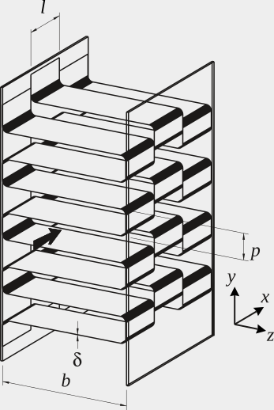

# The Rectangular Offset-fin Plate-fin Heat Exchanger: The Backward Forward Sideways Facing Step

**Steven B. Beale**

**2021-2022**

## Introduction

The problem considered is steady 3-D laminar flow and heat transfer in a rectangular offset-fin plate-fin heat exchanger. This particular problem was first considered by Beale in 1988, using the general purpose CFD code PHOENICS [1, 2][^1] with source-code written in FORTRAN. At the time, the case was selected as it provided a compact heat exchanger prototype for which experimental data were readily available, and one where a structured rectilinear body-fitted grid could be employed as a framework, unlike similar-related problems such as tube-bank heat exchangers [2, 3] which require a curvilinear or unstructured mesh to be constructed on and around the geometry. Previous numerical calculations had to-date been restricted to 2-D geometries [4, 5]. Stream-wise periodic boundary conditions, that is to say jump-cyclic conditions were initially coded explicitly, by adding one or more rows of ‘halo’ or ‘ghost’ mesh-cells across the streamwise direction. In order to simplify matters, the location of the boundaries was often chosen to lie across a region where the flow was ‘locally parabolic’, i.e., no re-circulation (not ‘locally elliptic’). The numerical results were found to compare favourably with experimental data in terms of overall friction factor, *f*, and heat transfer factor, *j*, as reported by Shah and London [6, 7].  Subsequently, the author devised a method for coding stream-wise periodic boundary conditions for generalized heat and mass problems using an implicit formulation, obviating the need for the construction of halo cells [8, 9].  

The motivation for the work is the solution for ‘fully-developed’ flow and scalar transport deep within the passages of regularly repeating heat exchanger modules, sometimes referred to as representative elements of volume (REVs). The results of fine-scale performance calculations for REVs may readily be employed in coarse-mesh simulations for large-scale heat exchangers, as well as mass exchange devices such as membrane separators [10] and chemical reactors. These may employ hundreds or thousands of REVs. This multi-scale approach is sometimes referred to as a ‘distributed resistance analogy’, Patankar and Spalding [11]. 

Also, from the results of the detailed fine-scale studies of the REV, contours of local Nusselt/Sherwood numbers are of practical relevance as they indicate clearly to the engineer how well, or otherwise, the design is performing thermally (and mechanically), thereby effecting improvement of the overall design. In this paper the method for reproducing this and other similar problems, with the OpenFOAM, is detailed to the reader.

Figure 1. Schematic of an offset rectangular fin plate-fin heat exchanger, illustrating the nomenclature and coordinate system, from [8]. The arrow indicates the main flow in the *x*-direction, d is the thickness of the solid strip-fins of length *l, b* is the distance separating the two heated plates, and *p* is the fin-pitch in the vertical *z*-direction. A representative element of volume (REV) of $2l \times p/2 \times b$ is selected for meshing in this study. Not to scale.

## Problem formulation and implementation

Figure 1 is a schematic of the compact heat exchanger design under consideration. A series of thin rectangular strips of fin, thickness,  d, length, *l*, are located between two plates separated by a distance *b*. The fin at *x* + *l* is offset from that at *x* by 50% of pitch, *p*, in the vertical, *z*-direction, as shown in Fig. 1. In this manner the momentum and thermal boundary layers are continuously being re-started from the leading edge of each of the fins, thereby enhancing heat transfer. Conversely, in the horizontal *y*-direction, the flow is ‘fully-developed’ with a parabolic-shaped velocity profile between the two plates at $y = ±b/2$.  In preceding works, the discretization scheme for the solid and fluid zones was realized by means of a single mesh through the solid and fluid regions, an approach sometimes referred to as a ‘monolithic’ formulation. Since no boundary nodes/patches are constructed at the cell faces corresponding to the interior solid-fluid interface, harmonic averaging [12] of the exchange coefficients, G = *k*/*cp*, is typically employed for the enthalpy equation. This adds, slightly, to the computational procedure, as compared to arithmetic averaging. An alternative to the ‘monolithic’ approach, is the so-called ‘partitioned’ approach, whereby the solid and fluid regions are decomposed individually, and tessellated with two distinct meshes, with the rate of heat flux and the drag force being common at the ‘external’ boundaries.  The latter approach is typically adopted in conjugate heat transfer tutorial examples provided with deliveries of the OpenFOAM code in the CHTMultiFoam group. Domain decomposition of the solid and fluid regions is readily achieved with the topoSet and splitMesh pre-processing utilities. The reader is referred to blockMeshDict, and topoSetDict dictionaries in the /system directory of the case provided.

Periodic boundaries may be prescribed as a combination of cyclic boundaries with the addition of a source-sink pair in the cross-flow direction. Mathematical details were provided in [8, 9] and will, therefore, not be reproduced here, apart from information salient to practical implementation. As an alternative, Patankar Liu and Sparrow [13] proposed transforming the transport equations to ‘reduced’ forms for which the field variables are cyclic, whereas Spalding [ref] suggested retaining the primitive forms for pressure and temperature.  The latter approach was adopted by the present author. The reasons for this are discussed elsewhere.

### Explicit and implicit procedures for periodic boundary conditions

One difference between PHOENICS and OpenFOAM is that for the former, boundary conditions were prescribed in-cell, as linearized source terms, $ S_P=C \times (V - ϕ_P)$, [2] whereas for the latter a set of boundary nodes is physically constructed, as a member of each mesh class instance. This is in some ways conceptually similar to the construction of ‘halo’ cells which require interchanging neighbour values of pressure, velocity, and temperature/enthalpy, at $x ± 2l$, see Fig. 1. A procedure similar to [3] may be entertained in OpenFOAM as follows:  

In the momentum equation  $S=\Delta p \vec{i}$, where $\vec{i}$ is a unit vector in the stream-wise *x*-direction and $\Delta p$ is the jump condition. This ensures that $p(x,y,z)=(px+2l,y,z) +\Delta p$. This term is added at a single *y-z* plane. Should, as is more usual, a fixed bulk velocity or Reynolds number, Re, be desired, then $\Delta p$ is proportionally adjusted [8].

## Discussion

The use of jump conditions can be further expanded beyond periodic applications in heat exchanger REVs. For instance, the presence of a fan in a flow may present an algebraic jump in pressure. Elsewhere, in mass transfer and electrochemical processes, finite jumps in species (mass fraction) and electric field potential are observed.  

## Acknowledgement

The author acknowledges meaningful dialogue on technical aspects of the material for this paper with Prof. H. Jasak and Dr. N. Weber, at different times. The lasting influence of the unique insight of Prof. D.B. Spalding on the subject matter of the work described here is also gratefully acknowledged.

## References

\1.	Beale, S.B., *Laminar Fully Developed Flow and Heat Transfer in an Offset Rectangular Plate-fin Surface.* PHOENICS Journal of Computational Fluid Dynamics and its Applications, 1990. **3**(1): p. 1-19.

\2.	Beale, S.B., *Fluid Flow and Heat Transfer in Tube Banks*, in *Dept. of Chemical Engineering and Chemical Technology*. 1993, Imperial College of Science, Technology and Medicine: London.

\3.	Beale, S.B. and D.B. Spalding, *Numerical study of fluid flow and heat transfer in tube banks with stream-wise periodic boundary conditions.* Transactions of the Canadian Society for Mechanical Engineering, 1998. **22**(4a): p. 397-416.

\4.	Patankar, S.V. and C. Prakash, *An Analysis of the Effect of Plate Thickness on Laminar-Flow and Heat-Transfer in Interrupted-Plate Passages.* International Journal of Heat and Mass Transfer, 1981. **24**(11): p. 1801-1810.

\5.	Kelkar, K.M. and S.V. Patankar, *Numerical Prediction of Heat-Transfer and Fluid-Flow in Rectangular Offset-Fin Arrays.* Numerical Heat Transfer, 1989. **15**(2): p. 149-164.

\6.	Shah, R.K. and A.L. London, *Offset Rectangular Plate-fin Surfaces - Heat Transfer and Flow Friction Characteristics*. 1967, Department of Mechanical Engineering, Stanford University.

\7.	Shah, R.K., *Data Reduction Procedures for the Determination of Convective Surface Heat Transfer and Flow Friction Characteristic Steam-to-Air Test Cores*. 1967, Department of Mechanical Engineering, Stanford University: Stanford.

\8.	Beale, S.B., *Use of streamwise periodic boundary conditions for problems in heat and mass transfer.* Journal of Heat Transfer, 2007. **129**(4): p. 601-605.

\9.	Beale, S.B., *Erratum:Use of streamwise periodic boundary conditions for problems in heat and mass transfer.* Journal of Heat Transfer, 2008. **130**: p. 127001.

\10.	Beale, S.B., J.G. Pharoah, and A. Kumar, *Numerical Study of Laminar Flow and Mass Transfer for In-Line Spacer-Filled Passages.* Journal of Heat Transfer, 2013. **135**(1): p. 011004.

\11.	Patankar, S.V. and D.B. Spalding, *A Calculation Procedure for the Transient and Steady-state Behavior of Shell-and-tube Heat Exchangers*, in *Heat Exchangers: Design and Theory Sourcebook*, N. Afgan and E.U. Schlünder, Editors. 1974, Scripta Book Company: Washington. D.C. p. 155-176.

\12.	Patankar, S.V., *Numerical Heat Transfer and Fluid Flow*. 1980, New York: Hemisphere.

\13.	Patankar, S.V., C.H. Liu, and E.M. Sparrow, *Fully Developed Flow and Heat-Transfer in Ducts Having Streamwise-Periodic Variations of Cross-Sectional Area.* Journal of Heat Transfer, 1977. **99**(2): p. 180-186.

[^1]: The reader who has difficulty obtaining references [1, 2] should write directly to the author.  
[^2]: The reader will appreciate that this notation, due to Spalding, for the source terms, mimics the neighbour terms in the linear algebraic equations. The more familiar form of Patankar with  $S_P=S_u+S_P\phi_P$ is to be considered entirely equivalent.